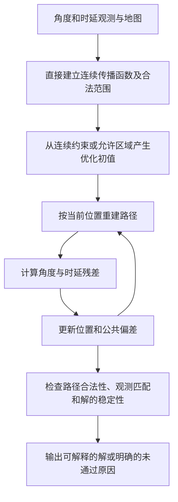

# 连续传播模型与位置、时钟偏差联合估计方案

日期：2026-09-15。本方案已经用户确认并进入实现；以下保留方案和实施前审计。实际代码、检查结果及运行方式见[实施记录](/data/zhujun/differt_projects/time-bias-correct/docs/continuous_model_implementation_20260915.md)。

核对代码：`master`，提交 `53aaf8833e0216e26a4236e5d66af08e11692263`。仓库：`/data/zhujun/differt_projects/time-bias-correct`。

## 1. 结论与两份回答的取舍

应该把最终估计改为：**根据当前位置重建合法传播路径，用预测角度、时延与原始观测的差来优化同一个 UE 位置和公共时钟偏差。**

**正式主流程明确为：CSI → 角度/时延观测 → 根据地图直接建立连续传播函数 → 联合残差优化位置和公共偏差 → 验证。**

新流程直接使用观测和地图，不经过“反向撒点 → 空间聚类 → 选代表 → 代表轨迹求解”。聚类、代表选择和旧 RANSAC 只保留在旧方法对照中，不承担新方法的前置筛选或初值生成。下文第 2、3 节是旧实现及其结果的审计，不是新流程的执行步骤。

目前的位置和偏差已经是连续变量。真正要解除的是：求解只能从有限条代表轨迹中选择，而且每条轨迹的方向、采样角度和采样时延都被固定。只更换优化算法，或者在这些轨迹上增加迭代次数，不会解除这种限制。

两份回答不能不加区分地合并：

- [第一份总结](https://chatgpt.com/share/6aa8f76c-94ec-83ec-8fc6-f16426002df6)将主要问题归为“多个代表被当成多个独立观测”。当前代码并非如此。
- [第二份代码审查](https://chatgpt.com/share/6aa8f506-b740-83ec-a79a-dc3362e6c2b4)明确指出每条观测最多一票，并提出检查候选丢失、离散方向残差和正向验证。此次本地核对支持这些具体判断。

“离散近似会引入额外误差”有代码和几何依据；“当前所有大误差都由它造成”还没有得到验证。固定代表集合时，降低观测噪声不能保证消除这部分误差；通过连续模型或合理加密可以减小近似误差，因此它不是物理上不可避免的下限。

## 2. 当前误差可能从哪里进入

### 2.1 有限方向与代表轨迹

[generate_bias_interval_points](/data/zhujun/differt_projects/time-bias-correct/src/time_bias_localization/bias_interval_candidates.py:131)枚举 BS 到绕射边缘的前缀，再按有限个方向追踪边缘另一侧的传播。当前 v6 每个观测采样配四个方向，方向在不同采样之间错开。

[build_representative_trajectories](/data/zhujun/differt_projects/time-bias-correct/src/time_bias_localization/initial_candidates.py:554)把每个入选代表转换成

\[
\mathbf p_{ik}(\beta)=\mathbf a_{ik}-\beta\mathbf u_{ik},\qquad \beta=cb.
\]

其中方向固定，只能通过改变公共偏差沿该方向移动。代表内保存的全部成员主要用于记录，并未变成连续拟合变量。

[RANSAC 的 assignment](/data/zhujun/differt_projects/time-bias-correct/src/time_bias_localization/ransac_solver.py:57)对每条观测选择当前合法且最近的代表，评分使用二维位置差；[重拟合](/data/zhujun/differt_projects/time-bias-correct/src/time_bias_localization/ransac_solver.py:91)仍调用[固定轨迹拟合](/data/zhujun/differt_projects/time-bias-correct/src/time_bias_localization/solver.py:420)。两处都受同一套离散方向限制。

绕射的[物理约束检查](/data/zhujun/differt_projects/time-bias-correct/src/time_bias_localization/ransac_solver.py:74)只给一个距离约束，但实际拟合仍使用固定方向下的两个坐标差。检查能够拒绝部分约束不足的组合，却不能消除拟合目标中的方向误差。

### 2.2 点密度筛选会丢掉候选

[cluster_initial_candidate_points](/data/zhujun/differt_projects/time-bias-correct/src/time_bias_localization/initial_candidates.py:325)按观测、完整传播顺序和参考偏差分组，再用空间密度聚类。没有形成簇的点会被记录为噪声，之后不生成代表。

绕射方向未知时，合法位置本来就可能分散。位置采样稀疏不能直接等同于观测不可信。当前门槛是 1.5 m 邻域内至少五点；应审计分支消失发生在哪一步。

传播顺序不同的分支已分组，不能把绕射候选丢失简单解释为“被反射候选挤出同一个簇”。

### 2.3 代表数量上限与覆盖范围

[select_cover_members](/data/zhujun/differt_projects/time-bias-correct/src/time_bias_localization/representative_cover.py:13)覆盖的对象是已生成且已留在簇里的成员。它不保证覆盖未采到的方向、被密度筛选删除的分支，也不保证最终定位误差。

v6 每簇最多 16 个绕射代表、每条观测最多 64 个。达到预算可能再次丢掉覆盖；增加 RANSAC 次数无法恢复已经删除的解释。

### 2.4 观测的误差仍然需要保留

最终轨迹还固定了某个采样成员的角度与时延。即使是直射或镜面反射，在有角度、时延误差时，最终结果也应回到观测残差，而不是必须沿选定采样的方向移动。

MUSIC 峰可能有偏差、漏检、近重复和相互关联的误差。连续几何模型不会自动修复这些问题。首次对照必须冻结 MUSIC 输出，以免混淆前端与求解器的贡献。

### 2.5 搜索和结果验证

RANSAC 固定抽样预算可能没有找到正确传播顺序。连续局部优化同样可能停在错误解附近，因此两者都需要多初值、备选解释和明确的预算状态。

[pipeline.py](/data/zhujun/differt_projects/time-bias-correct/src/time_bias_localization/pipeline.py:2082)当前以局部物理约束是否足够决定 `success`，没有把 `all_selected_paths_valid` 纳入这个条件。[forward_check_solution](/data/zhujun/differt_projects/time-bias-correct/src/time_bias_localization/forward_check.py:37)也明确说明自己只记录诊断。

因此，路径检查和拟合必须形成闭环：位置改变后重新检查路径；失效的解释不能继续支持最终解。

## 3. 保存的 v6 结果提供了什么证据

本轮只读取既有文件，没有重新运行实验，也没有重新核验整套生成文件的哈希。以下是指定结果目录的事实，不代表已证明误差成因。

根目录：`/data/zhujun/differt_projects/time-bias-correct/outputs/diffraction_boundary_ransac_v6_20260914_01`。

- [运行完成记录](/data/zhujun/differt_projects/time-bias-correct/outputs/diffraction_boundary_ransac_v6_20260914_01/run_records/20260914T090031_2366463/completion.json)：退出码为 0。
- [汇总](/data/zhujun/differt_projects/time-bias-correct/outputs/diffraction_boundary_ransac_v6_20260914_01/pilot/report/summary.json)：多代表组计划 150 次，77 次有位置输出，43 次被观测筛选排除，30 次观测峰不足；77 次输出中，71 次全部入选路径通过几何检查。
- 对[逐次记录](/data/zhujun/differt_projects/time-bias-correct/outputs/diffraction_boundary_ransac_v6_20260914_01/pilot/report/trials.csv)内这 77 个多代表组输出逐一读取 `localization/forward_check.json`：入选路径中的绕射路径数合计为零。
- 六个几何检查失败的输出仍记为 `success`：`PILOT_0003/repeat_003`、`PILOT_0012/repeat_000`、`PILOT_0025/repeat_000,002,003,004`。失败原因包括反射点不在指定墙段内、路径被墙遮挡。
- 两个大于 1 m 的输出为 `PILOT_0019/repeat_001`（5.49668 m）和 `repeat_004`（5.28675 m）。两者入选路径均无绕射，已选路径几何检查均通过。

这些逐次文件统一位于：

`/data/zhujun/differt_projects/time-bias-correct/outputs/diffraction_boundary_ransac_v6_20260914_01/pilot/benchmark_attempts/20260914T090033_141346_2366512/<UE编号>/<重复编号>/coverage/localization/forward_check.json`

两个大误差输出的具体路径：

- [PILOT_0019/repeat_001](/data/zhujun/differt_projects/time-bias-correct/outputs/diffraction_boundary_ransac_v6_20260914_01/pilot/benchmark_attempts/20260914T090033_141346_2366512/PILOT_0019/repeat_001/coverage/localization/forward_check.json)
- [PILOT_0019/repeat_004](/data/zhujun/differt_projects/time-bias-correct/outputs/diffraction_boundary_ransac_v6_20260914_01/pilot/benchmark_attempts/20260914T090033_141346_2366512/PILOT_0019/repeat_004/coverage/localization/forward_check.json)

这支持两个直接结论：绕射信息没有进入这批最终解；几何验证与成功状态之间确有缺口。但不能据此断定绕射完全无用，也不能断定这两个大误差直接来自绕射方向量化。可能的间接机制是绕射分支未能进入或支持正确解，仍需专门对照。

## 4. 最简单的连续模型

### 4.1 变量与观测

- UE 位置：\(\mathbf x=(x,y)\)。
- 所有路径共享的时钟偏差：\(b\)，单位秒；求解时用 \(\beta=cb\)，单位米。
- 第 \(i\) 条观测：原始细化峰的角度 \(\widehat\theta_i\) 与时延 \(\widehat\tau_i\)；记 \(z_i=c\widehat\tau_i\)。
- 传播分支 \(h\)：经过哪些墙、哪个绕射边缘及先后顺序。它是离散选择，不是额外观测。

保持符号约定：

\[
\widehat\tau_i=L_h(\mathbf x)/c+b+\epsilon_{\tau i}.
\]

同一次 CSI 请求中的所有路径只使用一个 \(b\)。观测误差与公共时钟偏差分开。

### 4.2 二维单次绕射

先考虑 UE 到已知墙角 \(\mathbf e_h\)，再沿固定传播路线到 BS。墙角到 BS 的长度记为 \(\ell_h\)。

\[
L_h(\mathbf x)=\|\mathbf x-\mathbf e_h\|+\ell_h,
\]

\[
\boxed{r_{i,h}^{L}(\mathbf x,\beta)
=\|\mathbf x-\mathbf e_h\|+\ell_h+\beta-z_i.}
\]

给定偏差后，它要求 UE 位于一段合法圆弧上，而不是圆弧上的某个采样点。圆弧要同时满足地图范围、阴影侧、无遮挡等条件。

也可以写成连续方向形式：

\[
\mathbf x=\mathbf e_h+(z_i-\ell_h-\beta)
\begin{bmatrix}\cos\phi_i\\\sin\phi_i\end{bmatrix}.
\]

这里 \(\phi_i\) 是未知连续方向。使用距离残差就消去了这个未知方向，不必给每条路径增加一个独立角度变量。

当前[地图绕射边缘](/data/zhujun/differt_projects/time-bias-correct/src/time_bias_localization/diffraction.py:27)是二维固定墙端点。因此本阶段只需连续优化 \((x,y,\beta)\)。第一份回答提出的“沿边缘移动绕射点”适用于另有连续边缘位置自由度的模型；不应直接套入当前二维固定墙角场景。将来扩展三维时，才需要结合边缘范围和绕射几何规律增加相应变量。

### 4.3 离散方向为什么会产生假残差

设真实位置距离墙角 \(r\)，最近代表方向与真实方向相差 \(\Delta\phi\)。在真实偏差下，两者距离为

\[
d_{\mathrm{sample}}=2r\left|\sin\frac{\Delta\phi}{2}\right|.
\]

例如 \(r=100\) m、方向差为 \(2^\circ\) 时，这个距离约 3.49 m。即使观测时延和地图都完全正确，旧目标在真值处仍有非零残差，而且会超过 v6 的 2 m 支持门槛。

连续距离残差在同一理想真值处为零。这是模型层面的区别。3.49 m 是该单路径的代表偏离量，不是对联合定位误差的预测，也不是误差下限。

### 4.4 直射、反射与混合传播

统一接口按当前 UE 位置、BS 和指定传播顺序计算：

\[
\big(L_h(\mathbf x),\theta_h(\mathbf x),\text{路径是否合法}\big).
\]

直射与固定反射序列的长度可以用镜像几何计算；含绕射且 UE 一侧还有反射时，可用等效墙角计算长度，再还原物理路径检查。已有 [rebuild_path](/data/zhujun/differt_projects/time-bias-correct/src/time_bias_localization/diffraction.py:121)能够对直射、镜面反射、单次绕射及混合顺序重新计算交互点，并检查路径。

必须根据当前位置重算反射点。旧代表的反射点、末段长度和合法偏差区间，只属于那条采样射线，不能直接限制整个连续分支。

固定二维墙角及其 BS 一侧的传播路线后，BS 看到的到达角由这一侧决定，对 UE 位置的局部导数为零。该角度仍能帮助选择正确墙角和传播路线，但不能充当墙角另一侧的出射角观测。

## 5. 用什么残差优化

### 5.1 同时比较角度和时延

对第 \(i\) 条观测和分支 \(h\)，定义

\[
\mathbf r_{i,h}(\mathbf x,\beta)=
\begin{bmatrix}
\operatorname{wrap}(\theta_h(\mathbf x)-\widehat\theta_i)/s_{\theta i}\\
(L_h(\mathbf x)+\beta-z_i)/s_{L i}
\end{bmatrix}.
\]

`wrap` 表示取跨越正负 180 度后仍正确的最短角度差。\(s_{\theta i}\) 与 \(s_{Li}\) 是误差尺度，用来避免把弧度与米直接相加；\(s_{Li}=c\,s_{\tau i}\)。

如果已有经过验证的角度—时延联合误差模型，可以使用联合协方差进行归一化；否则先明确采用固定工程尺度，并把尺度敏感性列入验证。不能把 MUSIC 谱值直接当作逆方差，也不能把同一峰生成的 128 个样本当成 128 次独立测量。当前[采样器](/data/zhujun/differt_projects/time-bias-correct/src/time_bias_localization/spectrum_sampling.py:305)已声明其提议概率未标定。

最终残差对照保存的细化峰。每条观测的连续函数直接根据地图中的墙面、边缘和传播顺序建立；不依赖角度—时延采样先产生位置点，也不挑一个最方便的采样值替代观测。不同峰来自同一 CSI 时还可能相关，暂不把分块误差近似包装成完整统计似然。

### 5.2 一个观测对应一个传播解释

固定某个传播解释组合时，最小化各观测残差的稳健损失，即让异常观测的影响不会无限增大。

总体目标可以写为：

\[
F(\mathbf x,\beta)=\sum_i
\min\left\{\lambda_i,
\min_{h\in\mathcal H_i:\mathbf x\in\Omega_h}
\rho\!\left(\|\mathbf r_{i,h}(\mathbf x,\beta)\|^2\right)
\right\}.
\]

- \(\mathcal H_i\)：这一观测的候选传播分支。
- \(\Omega_h\)：该分支真实成立的位置范围。
- \(\rho\)：降低大残差影响的损失函数。
- \(\lambda_i\)：把这条观测解释为异常或未匹配时的固定代价；没有合法分支时也支付该代价。

固定代价保证算法不能通过让路径消失而免费减少总误差。还需规定最少独立物理约束，避免全都不匹配的状态被当成解。

同一个观测仍只贡献一次。若多个近重复峰实际竞争同一条预测路径，还应在观测匹配层约束重复使用，不能仅靠不同观测编号就增加独立信息。

### 5.3 如何实际求解

传播路线之间仍是离散选择，路线内部的位置、偏差和交互点连续变化。跨越遮挡边界或切换路线时，整个目标不保证处处光滑。

建议采用：

1. 输入细化后的角度、时延观测和地图，直接构造各可能传播路线的连续长度、角度函数及合法范围。此时不生成 UE 候选点云，不进行空间聚类或代表选择。
2. 固定当前解释，在其合法区域内优化 \((x,y,\beta)\)。
3. 用更新的位置检查路径，并比较其他合法解释；必要时切换或放弃异常观测。
4. 重复至解释和位置稳定，保留评分接近但位置不同的备选解。
5. 统一完成路径合法性、原始观测残差、约束充分性和稳定性检查。

初值由连续约束组合或允许位置、偏差范围内的多起点搜索产生，不从旧聚类代表或旧 RANSAC 输出中取得。初值只影响从哪里开始搜索，不限制最终解必须落在哪些方向或点上。旧方法无法产生代表或无法给出结果时，新方法仍应能独立启动。

地图上有多面墙、多个墙角，意味着可能存在多个不同的连续函数；需要判断哪组函数能够共同解释观测。这种传播路线的选择不要求先把连续函数采成点云再聚类。构造范围由地图、允许的传播阶数和观测条件定义；未搜索的路线与计算预算要显式记录。

固定解释下可以采用 SciPy 的有界非线性最小二乘。它提供边界与稳健损失，但只寻找局部解。[官方说明](https://docs.scipy.org/doc/scipy/reference/generated/scipy.optimize.least_squares.html)

实现还需注意：通用最小二乘的坐标边界不会自动处理遮挡、墙段和阴影条件。应在分支合法区域内限制或回退更新步，必要时切换解释；不能把无效路径简单返回 `None` 或无穷大后期待求解器自行穿过边界。固定一次局部求解时残差维度应保持不变。

如果按整条观测使用稳健权重，应对角度和时延残差块一起更新权重；直接套逐分量损失对应另一个目标，需要在实现中保持定义一致。

### 5.4 公共偏差的可选简化

仅在解释固定、时延采用平方损失、权重固定且角度与时延未使用交叉协方差时，可给定位置后解析更新：

\[
\beta^*(\mathbf x)=\operatorname{clip}_{[\beta_{\min},\beta_{\max}]}
\frac{\sum_i w_i(z_i-L_{h_i}(\mathbf x))}{\sum_i w_i}.
\]

它可以降低子问题的搜索维度。使用稳健损失或改变解释时需重新求解相应的一维偏差问题，不能无条件套均值公式。第一版保留三个联合变量更容易核对正确性。

## 6. 代码改造位置与职责

以下为方案确定时的模块分工。实际已新增独立连续模块；具体接口及与计划的对应关系见实施记录。

| 模块 | 改造职责 |
|---|---|
| 新增 `propagation_model.py` | 定义传播分支；输入当前 UE，输出长度、BS 到达角、交互点、合法性及原因；优先复用 `rebuild_path`，验证后再加解析计算与导数。 |
| 新增 `propagation_hypotheses.py` | 直接根据地图墙面、边缘、BS 与观测构造可能的连续传播函数；登记合法范围和搜索预算，不读取旧候选点或点簇。 |
| 新增 `continuous_solver.py` | 保存独立观测，构造归一化残差，执行多初值优化、解释切换和共同偏差估计；输出备选解、残差与真实物理导数。 |
| `diffraction_prefixes.py` | 复用地图与 BS 到固定墙角的几何计算，为连续函数提供固定路径长度和角度；不调用绕射扇面撒点。 |
| `bias_interval_candidates.py`、`initial_candidates.py`、`representative_cover.py` | 只供旧方法和诊断对照使用；新流程不调用其中的候选点生成、聚类与代表选择。 |
| `ransac_solver.py`、`solver.py` | 旧离散 RANSAC 与线性轨迹拟合保留作对照；不作为新方法的必经步骤或初值来源。 |
| `forward_check.py` | 接受传播分支及原始观测，摆脱必须提供离散代表的输入要求；不沿用代表专属的偏差区间限制。 |
| `diffraction_diagnostics.py` | 根据新残差对位置、偏差的真实导数检查约束是否充分、是否对微小噪声过度敏感；不再使用固定方向模型的协方差。 |
| `pipeline.py`、`config.py`、峰位细化接口 | 将峰位细化与后续采样拆开，细化峰直接进入连续函数构造与求解；方法开关在反向候选点生成之前分流；正向几何和观测残差检查参与最终状态。 |
| 报告与启动脚本 | 保存原始观测、分支、初值、入选解释、残差、失效原因、备选解和计算预算。实现时配套 `run_continuous_model_check.sh` 与 `run_continuous_model_experiment.sh`。 |

新模型的基本记录应包含：观测编号、规范化后的 UE→BS 传播顺序、墙/边缘编号、原始角度时延、误差尺度、函数构造来源，以及尚未搜索的分支。地图与 BS 的前缀计算可能使用 BS→UE 顺序，与 `rebuild_path` 的正向输入顺序相反；统一转换后记录，不混用两种方向。

不要把参考偏差、代表坐标或代表方向作为新物理分支的身份。代表专属区间也不能直接取交集后当成整个分支的合法范围；位置变动后应重新检查。

图示：

## 7. 验证顺序与判据

### 7.1 先隔离模型近似误差

建立小型二维场景，在无噪声、地图一致、传播顺序已知的受控条件下，比较旧轨迹目标与连续目标。已知传播顺序只允许用于这项受控诊断，不进入正式在线流程。

真值方向应故意落在采样方向之间；改变方向网格的起始角、密度和代表数量。检查：

- 连续残差在真实位置和偏差处是否为零。
- 充分约束、几何良好的例子中，多初值连续估计能否达到事先规定的数值容差。
- 固定分支下，新最终目标是否摆脱代表密度、代表起始角与参考偏差的影响。
- 旧目标在相同真值处的残差及最终偏移有多大。

只在数值层面规定容差，不要求连续模型在有噪声实验中零误差。若可解模型无噪声下仍不能恢复，还要分清分支漏失、初值失败和局部优化失败。

### 7.2 正式新方法与可选诊断对照

正式比较是旧方法 A 与直接连续建模的新方法 D。冻结同一批 CSI、MUSIC 峰、观测筛选和地图；B、C 仅用于分解误差来源，不是新方法必须经过的实施阶段：

| 分组 | 连续函数或轨迹的来源 | 最终残差 |
|---|---|---|
| A：旧方法 | 旧候选点、聚类与代表 | 旧离散轨迹 |
| B：可选诊断 | 只取 A 留下的传播路线，重新建立连续函数 | 连续传播 |
| C：可选诊断 | 直接构造与 D 相同的连续函数，再主动离散成旧形式轨迹 | 旧离散轨迹 |
| D：正式新方法 | 从地图与观测直接建立连续函数，不经过候选点聚类 | 连续传播 |

B 与 A 用于观察相同路线范围内改变拟合约束的影响；D 与 C 用于观察相同连续函数被离散后产生的影响；D 与 B 的比较还受路线发现范围和搜索方式影响，不能将差异全部归给聚类。各组统一使用新的结果验证规则，并保留旧 `success` 作为历史字段，避免成功定义变化掩盖效果。

固定函数与初值的表示误差对照先在受控小场景进行；这与各算法使用自身搜索过程的完整运行对照分开报告。B 的旧路线限制以及 C 的主动离散仅存在于诊断配置，不能流入 D 的正式流程。

同时记录计算量、初值和分支覆盖。分支更完整但固定时间内搜不到，与分支根本不存在，是两种不同结果。受控小场景可做确定性参考搜索，用来检查随机搜索遗漏。

### 7.3 检查约束不足与假成功

至少覆盖：

- 两条纯绕射观测：三个未知量通常无法局部唯一确定。
- 三条绕射观测：只在独立且几何不退化时可能局部可解，仍需保留多解。
- 多条路径经同一等效墙角，只是 BS 一侧前缀不同：不能把重复距离约束算成新信息。
- 路径被墙遮挡、反射点越出墙段、绕射方向不在阴影侧：不能继续作为有效解释。
- 原始观测重复、角度跨越 ±180 度、地图边界附近更新、错误初值、近退化几何。
- 多个解都能解释少量观测：输出歧义，不能用较小的条件协方差宣称唯一。

### 7.4 再做既定规模的对照

使用相同的 30 个 UE、每点五次独立噪声观测。所有原始请求留在总分母内；单独报告排除、观测不足、搜索预算、几何不合法和多解。

除位置误差和偏差误差外，重点保存：绕射分支进入求解器的比例、最终入选绕射数量、原始峰的角度/时延残差、几何通过率、初值间差异，以及各阶段时间。

真实 UE、真实时钟偏差、真实路径、干净 CSI 和注入噪声参数仅供受控诊断或评估。正式分支筛选、权重、初值及最终接受规则不读取这些信息。

阶段区分：程序结束、已选路径几何成立、原始观测拟合良好、全路径集合解释充分、定位效果得到验证。当前 `forward_check` 只覆盖已选路径，不能当成全路径集合或 CSI 重建验证。正式科学接受仍需在限定传播阶数内检查完整预测路径集合与观测的匹配，明确漏检/假峰处理，避免仅挑少数能拟合的路径。

## 8. 实施边界

第一阶段固定现有二维几何与 MUSIC 观测定义，首先直接建立连续传播函数，再接入联合残差优化和验证。已有峰位细化若与后续采样绑定，需要拆开接口；不把修补聚类、增加代表或先跑旧 RANSAC 列为前置工作。暂不同时加入新的三维绕射位置自由度、材料复振幅或 CSI 全量重建目标，以便清楚辨别误差是否来自代表轨迹近似。

实现代码时配套规范的 `.sh` 脚本，集中设置解释器、输入、输出和预算；实验默认脱离终端后台执行，记录真实任务 PID、日志、参数、起止时间与退出码，并提供日志、状态、停止命令。所有新结果使用独立输出目录，保留本次 v6 作为对照。

**下一步应交付的是：可从当前位置计算传播预测的连续模型、基于原始观测残差的联合求解器，以及能区分模型误差与搜索遗漏的对照证据。**
